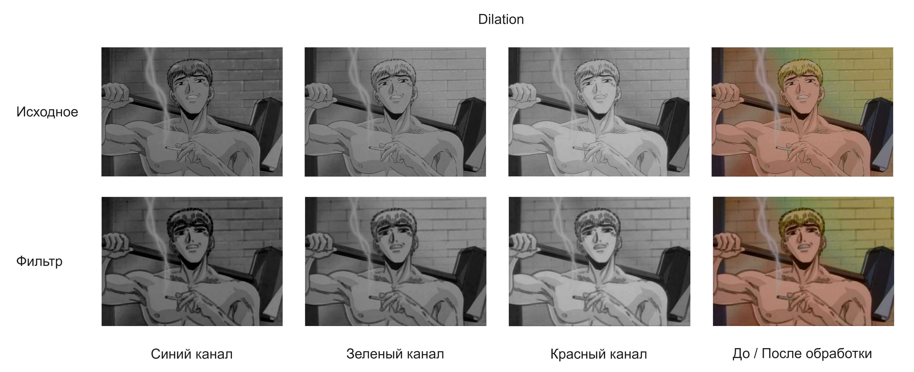
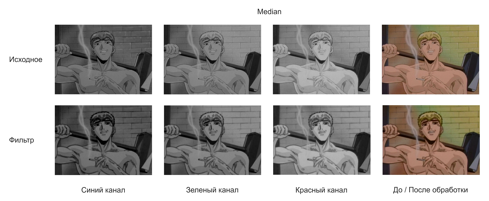
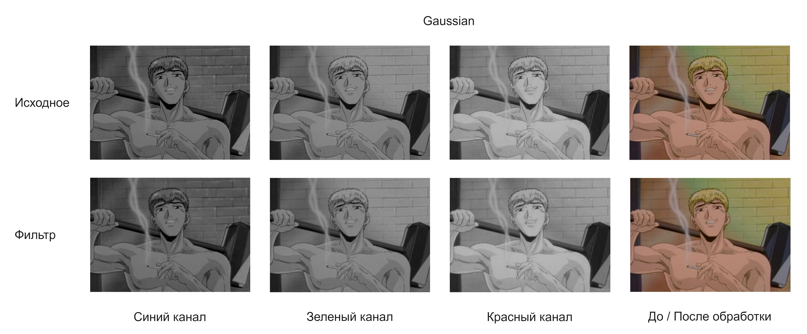
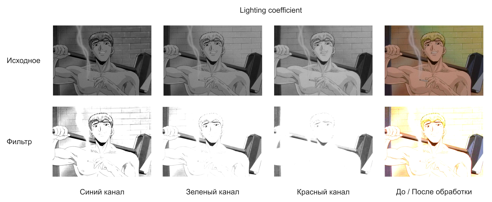
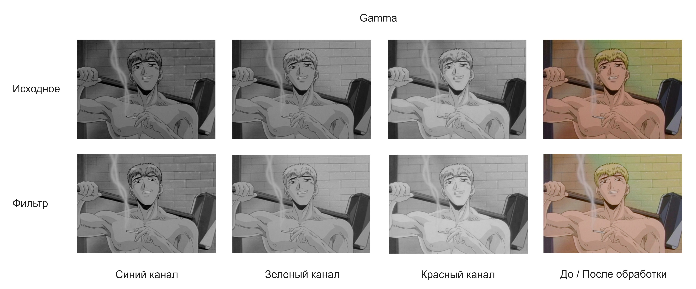
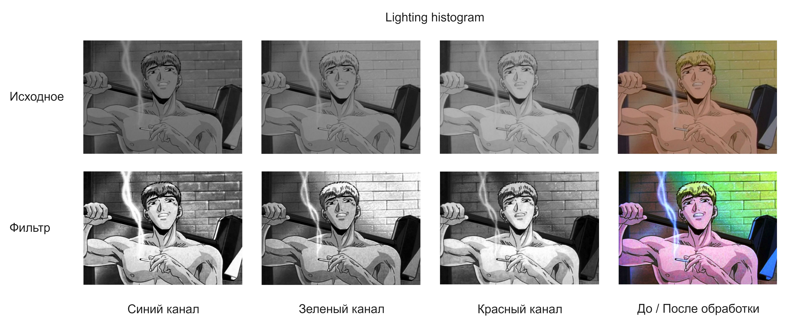
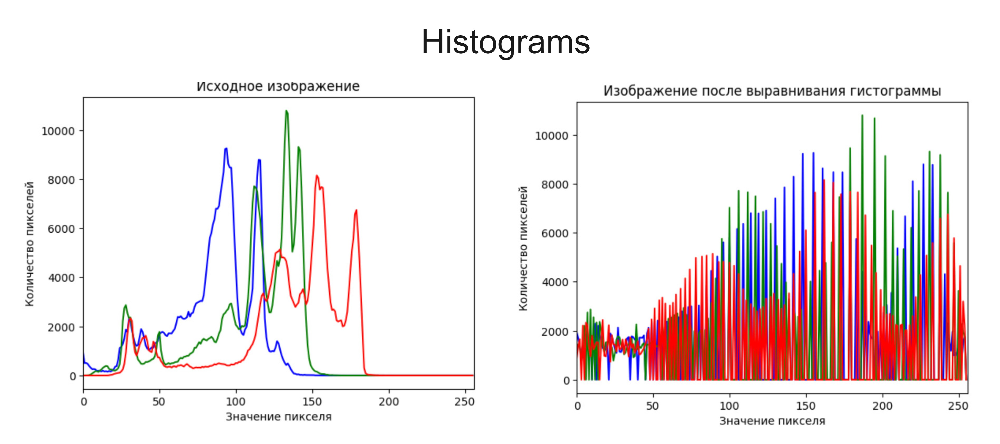
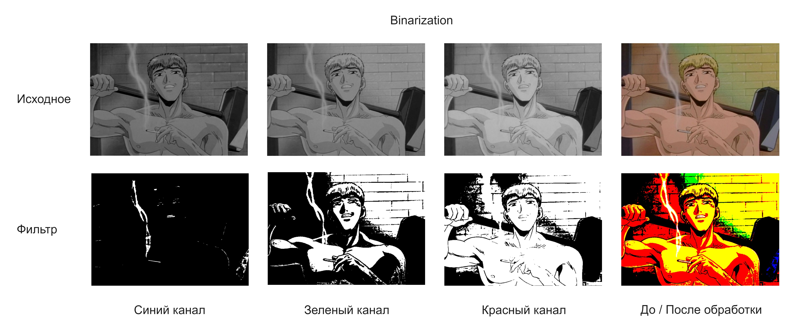

#   Проект лабораторной работы №1 по дисциплине "Системы копьютерного зрения"
##  Основная информация о задании
&ensp; В рамках данной работы было необходимо реализовать следующие фильтры:
1. Эрозия
2. Дилатация
3. Медианый фильтр
4. Фильтр Гаусса
5. Корректировка освещения
6. Бинаризация

### Дополнительная информация
&ensp; В качестве среды выполнения был выбран сервис Colab, так как имеется опыт работы в данной системе. 

&ensp; В качестве тестового изображения был взят цветной мем размерностью 351x400 (длина; высота), файл носит название Image_1.jpg.

&ensp; В файлах данного репрезитория можно найти файл с сервиса Colab, содержащий в себе весь проект (название CV_LB_1_Code.ipynb).

&ensp; В папке Image хранятся изображения, используемые в данном файле README для демонстрации результатов работы фильтров.

##  Размерность итогового и начального изображения
&ensp; Так как в проекте применяются фильтры, основанные на методе свёртке изображений, то размерность итогового изображения всегда меньше начального. Однако, в рамках повышения качества работы фильтра и для того, чтобы перенести на итоговое изображение всю информацию из начального изображения - необходимо предварительно увеличить размер начального изображения так, чтобы после проведения свёртки получившиеся изображение имело размер начального.
  
&ensp; Для этого необходимо увеличивать исходное изображение на величину *(d-1)/2*ц (где d - сторона квадратного ядра свёртки) в каждом из четырёх направленией (верхняя, нижняя, левая, правая грань).
Поэтому исходное изображение преобразуется в матрицу значений, после чего создаётся матрица размером, определяемым по формуле выше, после чего старое изображение вставляется в эту матрицу.

&ensp;Теперь необходимо обговорить, как будут заполнятсья новые пустые значения. Предполагается, что используемые ядра свёртки на несколько порядок меньше, чем размер изображения, что ведёт к тому, что информация по краям будет представлять собой меньшую часть изображения, что позволяет применить сравнительно простые техники заполнения. В частности - копирование и растягивание соседнего пикселя. Данный метод является одним из простейших, но при этом даёт приемлемый результат.
  
## Общий алгоритм работы
  &ensp;В проекте каждый фильтр реализован в своём независимом блоке, что упрощает работу с проектом и позволяет независимо друг от друга надстраивать фильтры. Все этапы обработки изображения от его растягивания до конечной свёртки прописаны индивидуально в каждом блоке.

  &ensp;После загрузки изображения, происходит его разбивка на три цветовых канала (BRG), что позволяет получить три матрицы изображения в оттенках серого (однако, под серым подрузамевается цвет цветового канала).

  &ensp;Фильтр применяется к каждому каналу изображения, после чего информация с канналов суммируется и обратно превращается в системиу RGB, что позволяет востановить обычное цветное изображение

## Фильтры
### Эрозия
&ensp; Данный фильтр основан на поиске наиболее тёмного пикселя в области ядра свёртки, после чего присваивать найденное значение центральному пикселю ядра свёртки. Фактически, результатом работы является выбор наиболее тёмного пикселя в определённой области. Как правило, после данного фильтра изображения получают эффект размытия с выделением тёмных участков изображения (все тёмные участки становятся больше по размерам и более ярко выраженными).

&ensp;На изображении ниже можно видеть этапы работы фильтра.

### Диалотация
&ensp; Данный фильтр работает аналогично предыдущему (эрозии), но с той разницей, что в ядре свёртки ищется не самый тёмный пиксель, а самый светлый. Что, фактически, делает итоговое изображение более светлым и с более светлыми цветами. 
&ensp; Результат работы данного фильтра представлен на изображении ниже.

### Медианный
&ensp; Данный фильтр работает следующим образом: в ядре свёртки анализируются все имеющиеся значения, после чего выстраиваются в список по возрастанию или убыванию (не имеет значение), после чего берётся среднее значение (назодящиеся в центре ряда (такое число гарантированно есть, так как при размери квадратной сетки с нечётным числом всегда будет одно единственное значение, являющиеся центром ряда). Значение пикселя в центре ядра свёртки будет значение в центре полученного численного ряда.
&ensp; Результат работы данного фильтра представлен на изображении ниже.

### Гаусовый
&ensp; Гауссовый метод основан на создании ядра свёртки, внутри которого будут коэффициенты, уменьшающиеся по мере удаления от центра. Задача гауссового фильтра - установить значение яркости пикселя на основе его окружения, при этом чем дальше от обрабатываемого пикселя (центра ядра свёртки) находится пиксель в ядре свёртки, тем меньше он влияет на итоговый результат обработки. То есть из-за незначительного коэффициента влияния, он будет вносить сравнительно небольшой вклад. 

&ensp; Данный фильтр часто используется для размытия изображений и сглаживания, однако для этого чаще всего применяются ядра свёртки, коэффициенты в котором рисуют круг/окружность, однако и прямоугольные ядра свёртки дают схожий результат. 

&ensp; Значение пикселя, в итоге, определяется суммой значений соседних пикселей, после их домножения на коэффициенты ядра свёртки. Стоит заметить, что арспределение коэффициентов может быть различно, чаще всего стараются придать максимальное значение центральному пикселю и после влияние пикселей резко идёт на спад. Данное распределение позволяет сохранить большую часть информации исходного пикселя. Однако, если в ядре свёртки соседние от центрального пикселя будут иметь большие коэффициенты влияния, не исключены ситуации, что центральный пиксель будет уже во многом определяться не центральным, исходным, а его окрестностью, что может привести к сильному размытию краёв объектов на изображении.

&ensp; Результат работы данного фильтра представлен на изображении ниже.

### Корректировка освещения (коэффициент)
&ensp; Данный мето доснован на том, что каждый пиксель на каждом из каналов изображения домнажается на определённый коэффициент (может быть в диапозоне от 0 до 255), однако, чаще всего он будет лежать в диапозоне от 0 до 2-3. Так как дальнейше увеличение коэффициента будет приводить к множеству пересветов, исключением могут быть изображения достаточно тёмной гаммой. После чего изображение вновь сшивается и получается изображение с большей яркостью ВСЕХ присутсвующих на ней пикселей.
&ensp; Результат работы данного фильтра представлен на изображении ниже.

### Корректировка освещения (гамма)
&ensp; Данный метод использует параметр “гамма” (γ) для нелинейного изменения яркости пикселей. В то время как коэффициент равномерно осветляет или затемняет все пиксели, гамма-коррекция изменяет яркость по степенной функции. Если γ меньше 1, то темные пиксели становятся значительно ярче, а светлые меняются мало. Если γ больше 1, то светлые пиксели затемняются сильнее, чем темные. 

&ensp; То есть каждый пиксель будет пересчитываться по формуле: Pix_gamma = 255 * (Pix/ 255) ^ gamma 

&ensp; Где: Pix_gamma - итоговое значение яркости пикселя, Pix - начальное значение яркости пикселя, gamma - коэффициент коррекции.

&ensp; То есть согласно формуле итоговый пиксель нормализуется в диапозон от 0 до 1, после чего возводится в степень гамма, что позволяет осветлять тёмные пиксели или затемнять яркие пиксели. 

&ensp; Результат работы данного фильтра представлен на изображении ниже.

### Корректировка освещения (гистограмма)
&ensp; Данный метод основан на составлении гистграмм для изображения (если речь про ЧБ изображение - для его единственного канала, если же говорить про цветное - то лучше всего будет обратить внимание на все каналы и вывести в отдельности для каждого) и последующего выравнивания гистограммы, с целью избегания выплесков/всплесков (возникновения большого числа пикселей с высокой или низкой яркостью и/или их скопления). Фактически, задача корректроивки через гистограмму постараться скорректроивать аномальные пиксели/их скопления (высокой, средней, низкой части яркости). Например, у нас в изображении могут преобладать тёмные пиксели (левая сторога гистограммы), тогда можно попробвоать сделать плавный переход, путём уменьшения/увеличения  яркости части пикселей (в правой части области низкой яркости или левой части средней яркости).

&ensp; Рассмотрим сразу гистограммы обрабатываемого изображения. Сперва рассмотрим исходные.

&ensp; Можно зметить, что в гистограмме синего изображения большая часть пикселей сосредоточена в левой части, что говорит об большом чилсе тёмных пикселей и это проблема, приводящая к перезатемнению изображения. В идеальном решении часть пикселей будет смещена вправо, то есть, их яркость будет увеличена.

&ensp; Аналогичная ситуация в гистограмме зелёного канала.

&ensp; Красный канал имеет небольшую просадку в средней части гистограммы, но в общем и целом - сбалансирован хорошо, относительно других. Ему нужна незначительная корректировка части левых и првых пикселей с смещением в центральную область, чтобы обеспечить плавный переход по яркости на всём изображении.

&ensp; 

&ensp; Можно заметить, что яркость части пикселей была увеличена и перенесена во многом к центру гистограммы (так как во всех трёх гистограммах проседала средняя часть по числу пикселей).

&ensp; В гистограмме красного цвета было наиболее простой и понятный результат - часть пикселей в средней части получили повышение яркости, и между ними примерно равные промежутки, чтобы среднее значение получалось более сбалансированным по отношению к крайним частям гистограммы.

&ensp; Рассмотрим теперь как эти преобразования выглядят визуально, на изображении, результат обработок представлен ниже.

&ensp; 

&ensp; Можно увидеть очень сильное изменение на визуальном восприятии синего канала. Теперь отчётливо видно лицо и прочие элементы изображения, хотя ранее там было сплошное чёрное пятно. Остальные же каналы подверглись куда менее серьёхным изменениям.

&ensp; Рассмотрим исходную и синтезированную гистограмму изображений. Можно заметить, что есть преобладание синего цвета, что, вероятно, вызвано необходимостью в высветлении картинки и сбалансированию её к нейтральным цветам. Итоговая картина выглядат гораздо натуральнее, чеи исходная (пусть и есть не характерный для совмременных изображений синий оттенок на многих участков изображения.

&ensp; 

&ensp; Можно заметить, что зелёный и синий цвет были смещены к центру, чтобы сделать переход более плавным, в чём и было предназначение фильтра в рамках данной задачи.

&ensp; Более подробно про математическую часть метода можно прочитать на [habr](https://habr.com/ru/articles/502986/)

### Бинаризация
&ensp; Данный метод необходим для разбития изображения на два типа пикселей: с минимальной и максимальной яркостью. Решение о переводе пикселя в максимальное или минимальное состояние основывается на том, больше он или меньше чем пороговое значение (выставляется пользвоателем). Для примера, если при пороговом значении в 100 едениц, будет анализирвоаться пиксель яркостью 101, то он будет светылм пикселем с яркостью 255 (белый), а если будет анализироваться пиксель 99, то он будет перекрашен в яркость 0 (чёрный цвет). Цвета белый и чёрный условные для каждого канала, вместо белого для каждого канала будет идти цвет канала.

&ensp; Результат работы данного фильтра представлен на изображении ниже. 

##  Результаты работы
&ensp; В рамках данной работы были изучены теорретически и реализованы в коде фильтры изображений, согласно поставленной задачи. Были созданы материалы, показывающие этапы работы фильтров, а так же позволяюще сравнить начальное и обработанное изображение после применения каждого из фильтров.

&ensp; Все результаты работы были оформлены в проекте на платформе GitHub, при этом сам код фильтров был реализован на платформе Colab (файл с кодами содержится в репрезитории на GitHub).
